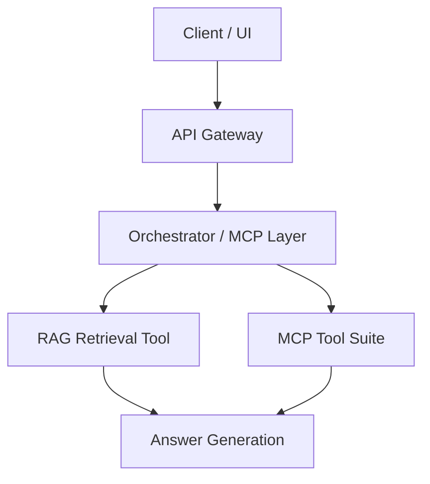
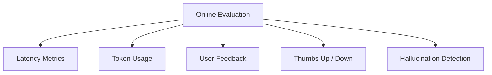
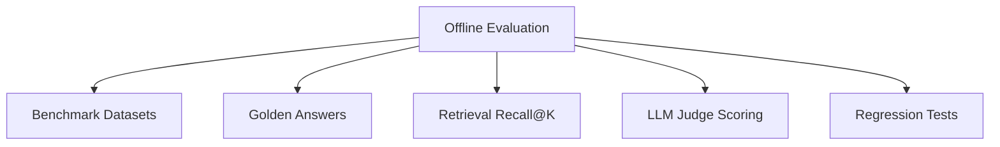

# chat-bot-docs

### High-Level Diagram

```mermaid
flowchart TD

A[Client / UI]

A --> B[API Gateway]

B --> C[Orchestrator / MCP Layer]

C --> D[RAG Retrieval Tool]
C --> E[MCP Tool Suite]

D --> F[Answer Generation]
E --> F

```

### Test/Eval Diagram
## Test / Evaluation Flow

```mermaid
flowchart TD

A[Online Evaluation]

A --> B1[Latency Metrics]
A --> B2[Token Usage]
A --> B3[User Feedback]
A --> B4[Thumbs Up / Down]
A --> B5[Hallucination Detection]
```

```mermaid
flowchart TD

A[Offline Evaluation]

A --> B1[Benchmark Datasets]
A --> B2[Golden Answers]
A --> B3[Retrieval Recall@K]
A --> B4[LLM Judge Scoring]
A --> B5[Regression Tests]
```
