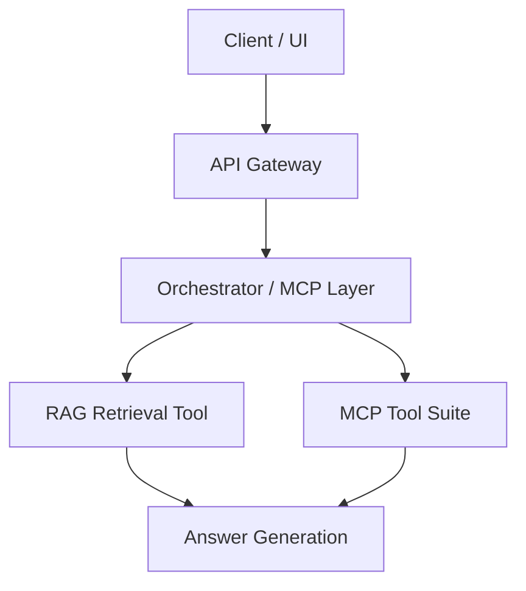
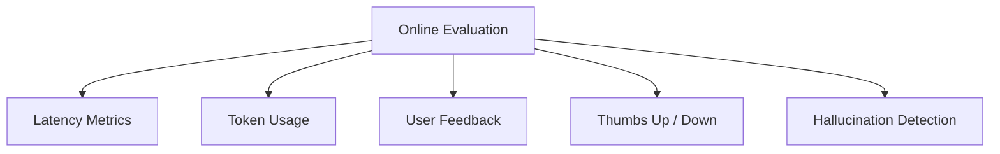
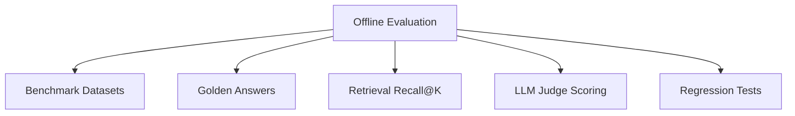
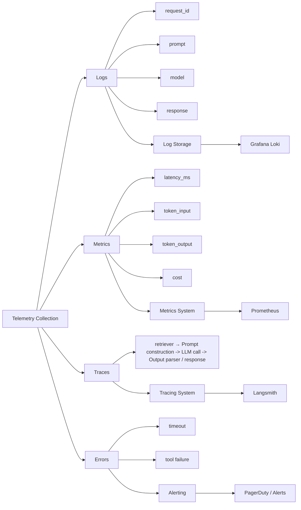
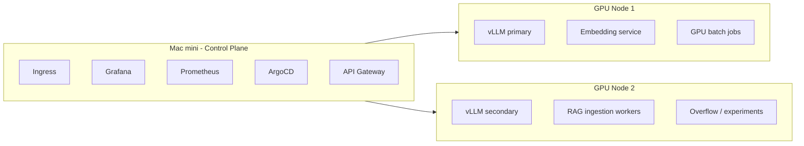

# chat-bot-docs

### High-Level Diagram

### Test/Eval Diagram
## Test / Evaluation Flow

### SRE

### k3s

### reliable design

#### 3-tier routing policy for model
* GPU1 local vLLM first 
* GPU2 local vLLM second (very large queue, e.g over 5, total 160 assuming inference batch 32)
* Cloud agent / OpenAI last for timeout, overload(over 10), or hard failure

#### Gateway

authentication (access control)

rate limit (5 requests / second / user, 60 requests / minute / user, Tokens per minute (TPM) 90 000)

request validation

### LLM workloads
1. vLLM continuous batching
 * higher GPU utilization (make close to 1, lile 0.9)
 * reduced latency
 * parallel requests
2. Horizontal scaling
