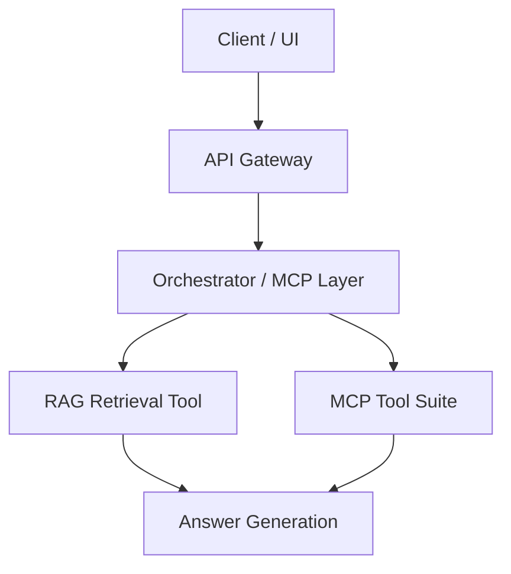

# chat-bot-docs

### High-Level Diagram




### Test/Eval Diagram
## Test / Evaluation Flow

```mermaid
Answer Generation
        │
   ┌────┴─────┐
   │          │
Online Eval   Offline Eval
   │              │
   │              ├─ Benchmark datasets
   │              ├─ Golden answers
   │              ├─ Retrieval recall@k
   │              ├─ LLM judge scoring
   │              └─ Regression tests
   │
   ├─ Latency
   ├─ Token usage
   ├─ User feedback
   ├─ Thumbs up/down
   └─ Hallucination detection
```
